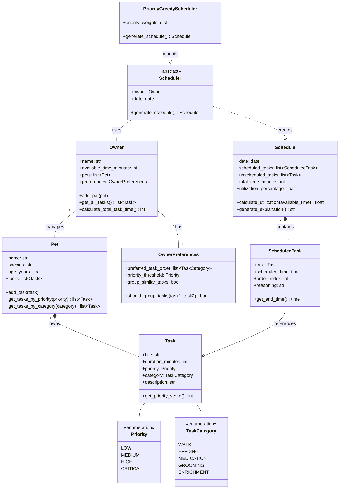

# PawPal+ UML Class Diagram

## Mermaid Class Diagram

## Class Responsibilities

**Task**: Represents a single pet care activity with duration, priority, and category

**Pet**: Manages a pet with their associated care tasks

**Owner**: Represents the pet owner with time budget, pets, and scheduling preferences

**OwnerPreferences**: Encapsulates owner's preferences for task scheduling

**Scheduler**: Abstract base class defining the scheduling algorithm interface

**PriorityGreedyScheduler**: Concrete scheduler that prioritizes tasks by priority level

**Schedule**: Output object containing scheduled tasks, unscheduled tasks, and explanations

**ScheduledTask**: A task with assigned time slot, order, and reasoning
